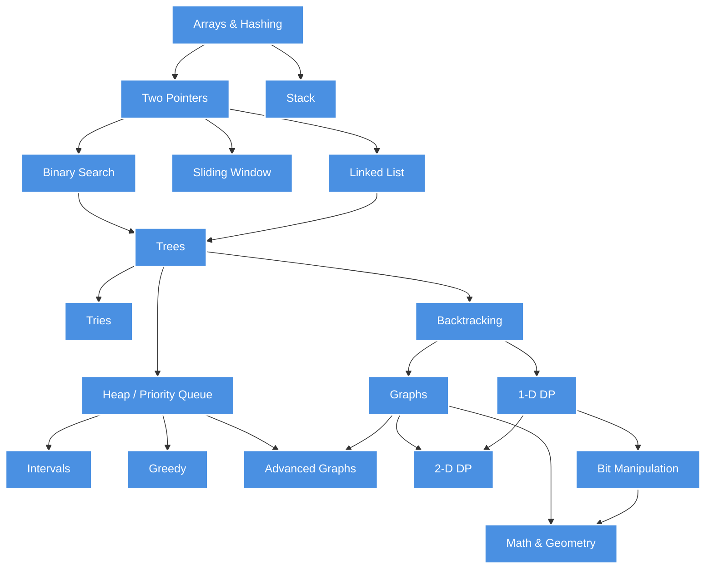

# NeetCode.io Problem Solving Journey

This repository contains my solutions and notes for various algorithmic problems organized by data structure and algorithm patterns.

## Learning Path (NeetCode Roadmap)

## Problem Categories

| Category                  | Description                                   | Key Concepts                       |
| ------------------------- | --------------------------------------------- | ---------------------------------- |
| **Arrays & Hashing**      | Foundation problems with arrays and hash maps | Two-sum, frequency counting        |
| **Two Pointers**          | Efficient array traversal techniques          | Left/right pointers, fast/slow     |
| **Stack**                 | LIFO data structure problems                  | Valid parentheses, monotonic stack |
| **Binary Search**         | Logarithmic search algorithms                 | Search space reduction             |
| **Sliding Window**        | Subarray/substring optimization               | Fixed/variable window              |
| **Linked List**           | Pointer manipulation problems                 | Reversal, cycle detection          |
| **Trees**                 | Binary tree traversal and manipulation        | DFS, BFS, recursion                |
| **Tries**                 | Prefix tree data structure                    | Word search, autocomplete          |
| **Backtracking**          | Recursive exploration with pruning            | N-Queens, permutations             |
| **Heap / Priority Queue** | Min/max heap applications                     | K largest elements                 |
| **Graphs**                | Graph traversal and algorithms                | DFS, BFS, topological sort         |
| **Advanced Graphs**       | Complex graph algorithms                      | Dijkstra, Union-Find               |
| **1-D DP**                | One-dimensional dynamic programming           | Fibonacci, climbing stairs         |
| **2-D DP**                | Two-dimensional dynamic programming           | Grid paths, LCS                    |
| **Intervals**             | Interval merging and scheduling               | Meeting rooms, merge intervals     |
| **Greedy**                | Locally optimal choices                       | Activity selection                 |
| **Math & Geometry**       | Mathematical and geometric problems           | GCD, prime numbers                 |
| **Bit Manipulation**      | Bitwise operations                            | XOR tricks, bit masking            |

## Progress Tracking

- [ ] Arrays & Hashing
- [ ] Two Pointers
- [ ] Stack
- [ ] Binary Search
- [ ] Sliding Window
- [ ] Linked List
- [ ] Trees
- [ ] Tries
- [ ] Backtracking
- [ ] Heap / Priority Queue
- [ ] Graphs
- [ ] Advanced Graphs
- [ ] 1-D Dynamic Programming
- [ ] 2-D Dynamic Programming
- [ ] Intervals
- [ ] Greedy
- [ ] Math & Geometry
- [ ] Bit Manipulation
